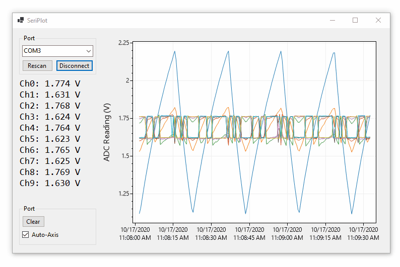

# SeriPlot

**SeriPlot is a Windows application that plots serial port data in real time.** SeriPlot is designed to be easy to modify to support custom data formats. SeriPlot is MIT licensed so it can be adapted for commercial applications, and it is easy to distribute as a click-to-run Windows application. 

## Download

**Download:** SeriPlot can be downloaded from the [**Releases page**](https://github.com/swharden/SeriPlot/releases).

> **⚠️ Warning:** SeriPlot is early in development, and currently is only capable of plotting data from ADC10 USB modules. See the [ADC-10-F103C project](https://github.com/swharden/ADC-10-F103C) for details.

## Resources

This list documents the various software options I was able to find for plotting data from serial port sensor modules in real time:

#### Free Software

* [SerialPlot](https://hg.sr.ht/~hyozd/serialplot/) - C++ and Qt
* [YAT (Yet Another Terminal)](https://sourceforge.net/projects/y-a-terminal/) - .NET, plotting supported (currently beta)
* [SerialLab](https://github.com/ahsayde/Serial-Lab) - C#, looks good, fixed format
* [ArduinoPlot](https://github.com/gregpinero/ArduinoPlot) - Python + Matplotlib
* [Arduino Plotter](https://github.com/devinaconley/arduino-plotter) - Arduino library
* [RealtimePlotter](https://github.com/sebnil/RealtimePlotter) - JavaScript
* RealTerm saving data + GnuPlot reloading the file
* [SimPlot](https://github.com/infomaniac50/projectsimplot) - Visual Basic program (binary available)
* [Telemetry](https://github.com/Overdrivr/Telemetry) Python + Qt (complex framed protocol)
* [Serial Chart](http://www.starlino.com/imu_kalman_arduino.html) - EXE, awkward configuration, crashed for me
* [Serial Monitor](https://github.com/hirohashi/SerialMonitor) - C++ source code only
* [RealTerm](https://sourceforge.net/projects/realterm/) - log a CSV while plotting it with another program

#### Commercial Software
* [MegunoLink](http://www.megunolink.com/) $29.95
* [MakerPlot](http://www.makerplot.com/) $39

#### Common Downsides
* Data format is often inflexible
* Arduino-specific JavaScript + Processing software
* Python GUI applications require complicated and brittle environments
* Not available as a click-to-run EXE
